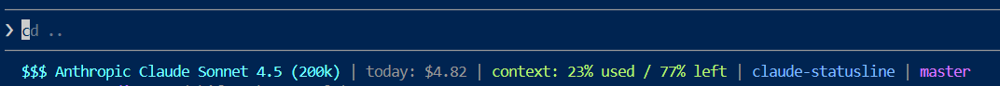

# Claude Code Status Line



A custom status line for [Claude Code](https://claude.ai/code) in Windows that shows:

```
Claude Sonnet 4.6 (200k)  |  today: $4.44  |  context: 21% used / 79% left  |  DQX | main
^^^ cyan                      ^^^ gray          ^^^ yellow                       ^blue^ ^green^
```

- **Model + context window size** — size read dynamically from the Claude Code payload (cyan)
- **Daily Foundry costs** — today's spend from your Anthropic Foundry instance (gray, optional)
- **Context usage** — % used and % remaining, color-coded:
  - **Green** when < 50% used
  - **Yellow** when 50-75% used
  - **Red** when > 75% used
- **Project folder** — name of the current working directory (blue)
- **Git branch** — current branch if inside a git repo (magenta), omitted otherwise

## Requirements

- Windows with PowerShell 5.1+
- [Claude Code](https://claude.ai/code) installed
- `git` on PATH (for branch display)
- Python 3.x with `requests` and `python-dotenv` (for Foundry cost tracking, optional)

## Install

```powershell
.\install.ps1
```

This will:
1. Copy `statusline-command.ps1` to `~/.claude/`
2. Add (or update) the `statusLine` entry in `~/.claude/settings.json`

Restart Claude Code after installing.

## Uninstall

```powershell
.\uninstall.ps1
```

Removes the script from `~/.claude/` and the `statusLine` entry from `settings.json`.

## Foundry Cost Tracking (Optional)

To display daily costs from your Anthropic Foundry instance:

1. Create a `.env` file in your project directory with:
   ```
   ANTHROPIC_FOUNDRY_API_KEY=your-api-key
   ANTHROPIC_FOUNDRY_BASE_URL=https://your-foundry-instance.com
   ```

2. Install Python dependencies:
   ```bash
   pip install requests python-dotenv
   ```

3. Place `get_foundry_daily_cost.py` in the directory specified in `statusline-command.ps1` (default: `C:\Users\arausch\Documents\VS_Studio\`)

The statusline will automatically fetch and display today's costs from your Foundry instance. If the script is not found or the API is unavailable, the cost display is silently omitted.

**Note:** The cost shown is specific to your API key's usage. For organization-wide costs, you need an admin-level API key.

## How it works

Claude Code calls the status line command on each turn, passing a JSON payload via stdin.
The script reads `workspace.current_dir`, `model.display_name`, and `context_window.*` from
the payload and formats them with ANSI colour codes.

For cost tracking, the script calls a Python script that queries the Foundry (LiteLLM) API's `/spend/logs` endpoint with today's date range to retrieve the current day's spend.
